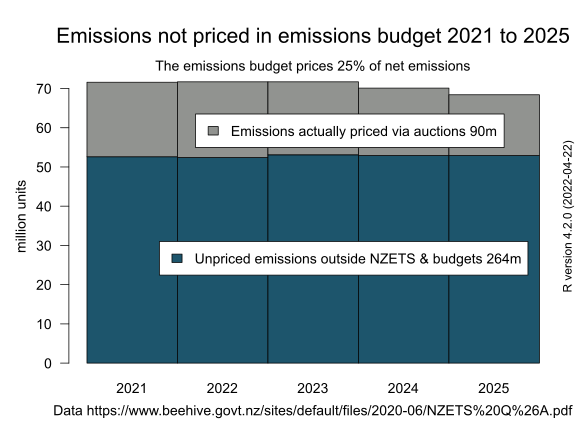

## Explaining the emissions budget it's the bodge that gives the number of emissions units to auction in the emissions trading scheme

I feel I need to do a deep dive into emissions budgets.

<i>The emissions budget is the bodge that papers over all the cracks and flaws in the [emissions trading scheme](https://genless.govt.nz/climate-change/the-emissions-trading-scheme-explained/) and gives  the number emissions units to auction into the carbon market.</i>

Specifically emissions budgets are a tool to [calculate the number of emissions units](https://environment.govt.nz/what-government-is-doing/areas-of-work/climate-change/ets/nz-ets-market/setting-unit-limits-in-the-nz-ets/#calculating-nzus-available-at-nz-ets-auctions) that will be auctioned to emitters under the [New Zealand Emissions Trading Scheme](https://environment.govt.nz/what-government-is-doing/areas-of-work/climate-change/ets/).

The Ministry for the Environment's web site has an explanation of how the [emissions budgets help calculate](https://environment.govt.nz/what-government-is-doing/areas-of-work/climate-change/ets/nz-ets-market/setting-unit-limits-in-the-nz-ets/#the-number-of-nzus-available-for-auction-over-2021-2027) the amount of units to auction into the [emissions trading scheme](https://genless.govt.nz/climate-change/the-emissions-trading-scheme-explained/) each quarter.

The Ministry for the Environment's web site features this chart showing the components of the emissions budget.

The web page then shows this table of the annual auction volumes.

However, the table and the chart don't match. They cover different five year periods. There is also an error in the html code of the table. There is a blank cell missing in the first row and first column. And the column headings need to be moved one cell to the right so that 'TOTAL' is above '75.2'. I emailed the Ministry back in February to politely let them know. However, nothing has changed.

I find that quite comical. The web site administrator and the external relations person just got so bored talking with the emission policy person that they fell asleep. If it's comedy, it's really a tragi-comedy. One day far in the future, alien anthropologists will discover that the planet Earth missed it's global warming goals because of ["My Eyes Glaze Over"](https://en.wiktionary.org/wiki/mego) syndrome.

Specifically, the emissions budget is the 2020 provisional emissions budget for the years 2021 to 2025. This comes from a [Q and A document](https://www.beehive.govt.nz/sites/default/files/2020-06/NZETS%20Q%26A.pdf) attached to a Government media release dated 2 June 2020 [Emission trading reforms another step to meeting climate targets](https://www.beehive.govt.nz/release/emission-trading-reforms-another-step-meeting-climate-targets) by James Shaw Minister for Climate Change Issues.

These five year emissions budgets roll forward as each year passes. So the current emissions budget is 2023 to 2027.

What is the point of the five year emissions budget?

It is to drag down the trend line in New Zealand's gross and net emissions of greenhouse gases. This is helpfully shown by this chart from the Climate Change Commission's advice to the Government. We can see the three jaffa and blue coloured bars representing the three five year budgets 1, 2 and 3 sequentially reducing and pulling down the trend line of emissions.

This next chart, 'Figure 7' from the Ministry for the Environment presents what looks like an area chart. (Except its actually a barplot of five time intervals.) Look at the area underneath the black dashed line of net emissions and the solid red line of a trajectory towards the 2030 emissions target. A wedge shaped area of 'additional reductions' is needed to drag the forecast down to the trajectory to the target. The area under the trajectory (to the target) is 354 million tonnes of net emissions.

Here is my version of the same bar chart of five years of emissions. It uses the same area 354 million tonnes of net emissions (derived from the 2030 target) and the same colours.

The next step is to add the target trajectory red line and the annual amounts of net emissions from 72 million tonnes in 2022 to 68 million tonnes in 2025.

So, okay, we have an [emissions trading scheme](https://www.climatecommission.govt.nz/our-work/advice-to-government-topic/nz-ets/about-the-nz-emissions-trading-scheme/what-is-the-nz-ets/) Those 354 million tonnes of greenhouse gases will be represented by 354 million emission units that could be auctioned to emitters. As basic economics says that will be the most efficient way of allocating the emissions units to emitters.

Ha ha ha! Of course that's not what is done! Instead we have to do a [bodge](https://www.urbandictionary.com/define.php?term=bodge) and subtract millions of tonnes from the emissions budget to deal with the fundamental flaws in the emissions trading scheme. This is the crux of the problem. However, neither James Shaw or the Ministry for the Environment discuss this 'budgetting' as the crude [bodge](https://www.urbandictionary.com/define.php?term=bodge) that it is.

The emissions of pastoral agriculture are not subject to the emissions trading scheme. And perhaps may never be subject to emissions pricing if Beef and Lamb NZ's latest [anti-regulation campaign](https://www.stuff.co.nz/business/farming/opinion/131502555/farmers-are-under-pressure-and-all-new-zealanders-should-be-concerned) succeeds. So the next step is a 'bodge' to subtract the emissions of agriculture. This is 194 million tonnes, more than half the emissions budget of 354 million tonnes.

So are the 160 million tonnes to be auctioned? No, there's another subtraction. Under the emissions trading scheme [industrial allocation rules](https://www.epa.govt.nz/industry-areas/emissions-trading-scheme/industrial-allocations/), emissions-intensive industries are given free emissions units...which they then surrender back to the Government. So those emissions are not priced. Free allocation of units has the same effect as the exemption of agriculture, the units have to be subtracted from the emissions budget as you can't auction units that have already been given for free to emitters. The numbers are 8.6 million units per year or 43 million for 2021 to 2025.

Is that it? No, there's another bodge. There are too many emission units in private hands. There were [164,329,773 emission units](https://www.epa.govt.nz/industry-areas/emissions-trading-scheme/market-information/privately-held-units/) held by account holders in the Emissions Unit Register at 31 December 2022. This surplus is called the stockpile. You can't auction units that are already owned by emitters. The Climate Change Commissions and the Government would like to reduce the stockpile. So another 27 million tonnes are subtracted.

Now my chart of the 2020 provisional emissions budget is almost the same as the Ministry of the Environment's chart. That final bodge leaves a budget of 90 million tonnes left to auction into the carbon market over the five years. Or 18 million per year. Or 4.75 million emissions units to be auctioned from the first [quarterly auction](https://www.etsauctions.govt.nz/public/auction_noticeboard/12) of emission units held on 17 March 2021.

This chart displays the same unit numbers and shows the sum of the bodges, how 264 million tonnes out of 354 million tonnes are not priced through the emissions budget process.

This chart has the same axes as the previous chart but just shows the number of units to be auctioned. Only 90 out of 354 million tonnes of emissions are priced via the auctions.

This chart now summarises the message of the two previous charts. Because the design flaws in the emissions trading scheme require bodges (by subtraction) to the emissions budget, only a quarter (25%) of the 2021 to 2025 emissions budget is expected to be priced via auction sales to emitters.

Summary points to note. The emissions trading scheme has fundamental flaws in it's design:

<ol>
  <li>the exclusion of agricultural emissions from ETS obligation,</li>
  <li>the excessively generous industrial allocation of free emissions units to emitters,</li>
  <li>the excessive surplus of privately held emission units reflecting the importing of 'hot air' international units.</li></ol>

These three flaws require bodges to the emissions budgetting process that reduce the quantity of emissions subject to an emissions price.

